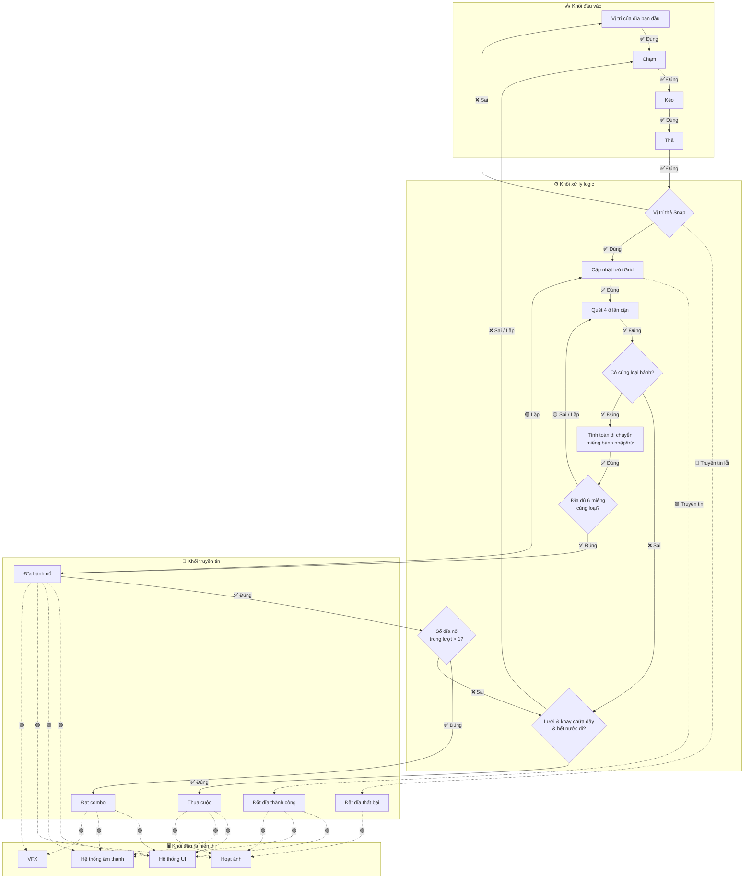

# ARCHITECTURE: Cheezy Savoround

**Last Updated:** 2026-06-15
> **AI CONTEXT:** This document is the authoritative technical reference. Read this FIRST for any technical question. Do not guess architectural patterns — verify here.

---

## 1. High-Level Structure

Trò chơi sử dụng cấu trúc Component-based kết hợp kiến trúc Manager (Singleton hoặc Event System) để quản lý luồng dữ liệu.

### Sơ đồ luồng (Game Flow Diagram)

> **Nguồn:** `docs/Ve_so_do_game_banh_pizza.png` — Vẽ lại ngày 2026-05-31



**Chú thích màu sắc:**

- ✅ Mũi tên xanh lá (liền): Nhánh ĐÚNG — luồng logic chính
- ❌ Mũi tên đỏ (liền): Nhánh SAI — rollback hoặc điều kiện thất bại
- 🟡 Mũi tên vàng (liền): SAI / LẶP — tạo vòng lặp combo chain
- 🟢 Mũi tên nét đứt: Truyền tin sự kiện (Observer Event) — kích hoạt hệ thống độc lập (UI/Sound/VFX/Animation)
- 🔴 Mũi tên đỏ nét đứt: Truyền tin lỗi — chỉ phát event báo cho người chơi biết đặt sai

**Mô tả từng khối:**

- **Khối Đầu Vào:** Nhận thao tác Drag & Drop qua `Raycast` (Touch → Kéo → Thả).
- **Khối Logic:** Snap đĩa vào lưới, cập nhật Grid 3D, quét 4 hướng, tính toán luân chuyển miếng bánh, kiểm tra điều kiện Nổ (6 miếng cùng loại), kiểm tra Combo, và Game Over.
- **Khối Truyền Tin:** Gửi sự kiện bằng Observer Pattern. Bao gồm cả event thất bại (Snap sai) để kích hoạt hoạt ảnh phản hồi lỗi.
- **Khối Đầu Ra:** Hệ thống UI (sinh đĩa mới, cập nhật điểm), Sound, VFX Particle, và Hoạt ảnh (Tweening/Bezier) phản hồi độc lập với logic.

---

### Mô tả chi tiết sơ đồ (Nguồn gốc từ cty)

#### Các khối

**Khối đầu vào:** Vị trí của đĩa ban đầu → Chạm → Kéo → Thả

**Khối xử lý logic:** Vị trí thả Snap, Cập nhật lưới Grid, Quét 4 ô lân cận, Có cùng loại bánh?, Tính toán di chuyển miếng bánh nhập/trừ, Đĩa đủ 6 miếng cùng loại?, Số đĩa nổ trong lượt > 1?, Lưới & khay chứa đầy & hết nước đi?

**Khối truyền tin:** Đặt đĩa thất bại, Đặt đĩa thành công, Đĩa bánh nổ, Đạt combo, Thua cuộc

**Khối đầu ra hiển thị:** Hệ thống UI, Hệ thống âm thanh, Hoạt ảnh, VFX

#### Luồng nối chi tiết

1. "Vị trí của đĩa ban đầu" nối đúng đến "Chạm" → nối đúng đến "Kéo" → nối đúng đến "Thả"
2. Từ "Thả" nối đúng đến "Vị trí thả Snap":
   - Nhánh **sai** → về "Vị trí của đĩa ban đầu", đồng thời truyền tin sự kiện đến "Đặt đĩa thất bại"
   - Nhánh **đúng** → "Cập nhật lưới Grid" → truyền tin sự kiện đến "Đặt đĩa thành công" → tiếp tục đến "Quét 4 ô lân cận" → "Có cùng loại bánh?"
     - Nhánh **sai** → "Lưới & khay chứa đầy & hết nước đi?"
     - Nhánh **đúng** → "Tính toán di chuyển miếng bánh nhập/trừ" → "Đĩa đủ 6 miếng cùng loại?"
       - Nhánh **sai** → quay về "Quét 4 ô lân cận" (vòng lặp)
       - Nhánh **đúng** → "Đĩa bánh nổ" → truyền tin sự kiện về "Cập nhật lưới Grid" để reset ô (chain combo)
3. Từ "Đĩa bánh nổ" → "Số đĩa nổ trong lượt > 1?":
   - Nhánh **đúng** → "Đạt combo"
   - Nhánh **sai** → "Lưới & khay chứa đầy & hết nước đi?"
4. Từ "Lưới & khay chứa đầy & hết nước đi?":
   - Nhánh **đúng** → "Thua cuộc"
   - Nhánh **sai** → quay lại "Chạm" (vòng lặp)
5. "Đặt đĩa thất bại" → truyền tin sự kiện đến "Hoạt ảnh" (báo người chơi đặt sai)
6. "Đặt đĩa thành công" → truyền tin sự kiện đến "Hệ thống UI" (để sinh đĩa có ngẫu nhiên các miếng pizza), "Hệ thống âm thanh", "Hoạt ảnh"
7. "Đĩa bánh nổ" → truyền tin sự kiện đến "Hệ thống UI", "Hệ thống âm thanh", "Hoạt ảnh", "VFX"
8. "Đạt combo" → truyền tin sự kiện đến "Hệ thống UI", "Hệ thống âm thanh", "VFX"
9. "Thua cuộc" → truyền tin sự kiện đến "Hệ thống UI", "Hệ thống âm thanh", "Hoạt ảnh"

#### Chú thích màu sắc (theo sơ đồ gốc)

1. Màu **xanh lá** (liền): Đúng
2. Màu **đỏ** (liền): Sai
3. Màu **vàng** (liền): Sai / Lặp
4. Màu **xanh lá nét đứt**: Truyền tin sự kiện đúng
5. Màu **vàng nét đứt**: Truyền tin để lặp (chain combo)
6. Màu **đỏ nét đứt**: Truyền tin lỗi từ "Vị trí thả Snap" → "Đặt đĩa thất bại" — chỉ để chạy hoạt ảnh báo người chơi đặt sai

### Merge & Purge Rules (Zero-Deadlock)

Để ngăn chặn các lỗi lặp vô hạn (Infinite Bounce/Pull Loop) khi các đĩa bánh giao tiếp, hệ thống áp dụng các đạo luật thép sau:

1. **Focus Identity (Định danh tập trung):** Khi đĩa chưa đầy, nó CHỈ ĐƯỢC PHÉP HÚT loại bánh mà nó đang sở hữu với số lượng nhiều nhất (Đa số). Tránh việc tự hút rác ngược vào người sau khi đã xả.
2. **Global Purging State (Trạng thái Xả Rác):** Khi bất kỳ đĩa nào (Priority 0-9) bị đầy (6/6) nhưng không tinh khiết, nó kích hoạt cờ `IsPurging = true`. Lúc này đĩa BỊ CẤM HÚT, chỉ được phép ĐẨY (Push) các loại bánh thiểu số đi. Nó sẽ giữ cờ này đến khi đẩy sạch rác và trở nên tinh khiết.
3. **Anti-Bounce (Chống dội rác):** 
   - Một đĩa đang xả rác TUYỆT ĐỐI KHÔNG được ném rác vào một đĩa lân cận đang có 5/6 miếng (vì ném vào sẽ làm đĩa kia đầy, kích hoạt Purging và dội ngược lại rác cũ), trừ khi miếng rác đó giúp đĩa kia nổ.
   - Khi đang hút bánh, nếu một đĩa có 5/6 miếng, nó **CHỈ ĐƯỢC PHÉP HÚT loại bánh chiếm Đa Số** của nó. Tuyệt đối cấm hút bánh thiểu số (ngăn chặn lỗi 4:2 vs 4:4 bounce loop).
4. **Smart Garbage Selection:** Khi cần xả rác, hệ thống ưu tiên ném vào đĩa đã có loại rác đó. Nếu không có đĩa nào phù hợp, hệ thống chọn đĩa đang có TỔNG SỐ LƯỢNG BÁNH ÍT NHẤT để ném (nhằm tránh làm nghẽn các đĩa sắp nổ).
5. **No Swapping:** Cơ chế Swap (đổi 1 lấy 1) bị loại bỏ hoàn toàn để tránh vòng lặp đổi rác qua lại giữa 2 đĩa đầy.
6. **Transit Station (Trạm trung chuyển - Priority 9):** Đĩa tâm chấn (nơi người chơi vừa đặt) được xử lý ưu tiên với cơ chế 3 pha:
   - *Phase 1 (Self-Explode):* Quét toàn bộ hàng xóm, nếu thấy có thể gom đủ 6 miếng của một loại (khả thi) → Hút về để tự nổ.
   - *Phase 2 (Relay):* Nếu không thể nổ, epicenter đóng vai trò trung chuyển. Nó sẽ hút loại bánh "lạc lõng" từ một hàng xóm ít bánh, giữ tạm (dù có thể thành 6/6 không tinh khiết) và lập tức đẩy sang hàng xóm đang chứa nhiều bánh loại đó hơn. Sử dụng bộ đệm riêng biệt (`Dictionary<GridCell, (int, GridCell)> _pendingRelays`) để lưu trữ dữ liệu trung chuyển nhằm chống đè chéo khi có nhiều tâm chấn cùng lúc.
   - *Phase 3 & 4:* Xử lý hút / xả rác bình thường nếu 2 pha trên thất bại.
7. **Tie-breaker FIFO Queue:** Khi lưới có nhiều đĩa cùng mức ưu tiên (đặc biệt là Priority 9), hệ thống sử dụng bộ đếm `_enqueueOrder` để xử lý theo thứ tự FIFO (Vào trước ra trước). Đảm bảo các chuỗi combo và chuỗi relay trung chuyển không bị ngắt quãng bởi đĩa khác.

---

## 2. Identified Patterns

### Finite State Machine (FSM)

**Location:** Core Gameplay Loop (e.g., `GameManager` hoặc `GameStateManager`)
**Purpose:** Tránh lồng chéo biến boolean. Phân định rõ ràng các trạng thái `PlayingState`, `AnimatingState`, `CheckingComboState`, `GameOverState`.

### Observer Pattern (Event System)

**Location:** Cốt lõi giao tiếp giữa Logic và Hiển thị.
**Purpose:** Giảm Tight Coupling. UI và Audio sẽ lắng nghe (listen) các event như `OnPizzaMerged`, `OnComboAchieved` thay vì bị gọi trực tiếp từ code Logic.
**Quy tắc Separation of Logic and View:**
- **Logic ưu tiên tuyệt đối:** Mọi sự kiện liên quan đến dữ liệu (như cộng điểm `TriggerPlateExploded`) phải được kích hoạt NGAY LẬP TỨC khi FSM chuyển trạng thái (VD: Kết thúc `CheckingComboState`). Tuyệt đối không được bọc event logic bên trong các hàm delay hay coroutine chờ UI.
- **View phản ứng độc lập:** Các hiệu ứng UI (như thả chữ `Combo x3!`) có thể dùng `DOVirtual.DelayedCall` để chờ nhịp hoạt ảnh trước đó kết thúc (VD: chờ chữ `+100` mờ đi), nhưng chúng không được phép cản trở luồng chạy của dữ liệu. Biến truyền vào View closure phải được sao lưu local (Capture by value) để tránh rủi ro Race Condition khi logic đã bước sang lượt tiếp theo.

### Object Pooling

**Location:** Hệ thống sinh vật thể.
**Purpose:** Tái sử dụng các Prefab sinh ra liên tục (Miếng bánh bay, VFX nổ, Text điểm số) nhằm triệt tiêu bộ thu gom rác (Garbage Collector).

### Data-Driven Design

**Location:** Cấu trúc Level, Item và Shop.
**Purpose:** Tách rời cấu hình ra khỏi code. Sử dụng JSON để lưu tiến trình (Vàng, Skin) và cấu hình Level động. Sử dụng `ScriptableObject` (`ShopConfig`) để quản lý tập trung toàn bộ danh sách vật phẩm (Skins, Boosters, CoinPacks), giúp dễ dàng cân bằng game và bổ sung đồ mới trực tiếp qua Inspector mà không cần sửa code UI.

## 3. Data Flow & Performance

- **Zero GC Alloc:** Trong hàm `Update()`, cấm tuyệt đối không dùng `GameObject.Find`, `GetComponent`, hay khởi tạo object mới (`new`).
- **Render Optimization:**
  - Gộp UI tĩnh vào Sprite Atlas.
  - Canvas tĩnh và động phải nằm trên 2 Canvas riêng biệt.
  - Sử dụng GPU Instancing và Static/Dynamic Batching cho mô hình 3D để giữ < 50 Batches.

## 4. Code Organization & Conventions

**Structure Approach:** Domain-based / Feature-based folders trong Unity (e.g., `Scripts/Core/`, `Scripts/UI/`, `Scripts/Data/`).
**File Naming:** PascalCase cho Class/Struct.
**Testing Strategy:** Play mode test bằng tay và Unity Test Framework (nếu cần).

## 5. Structural Tree (Unity Assets)

```
Assets/
├── Fonts/              (SUPER GIGGLE SDF - TextMesh Pro font)
├── Materials/          (CubeTest, Den, Plate, TableZasiki_dif 1, lobby)
├── Models/             (Floor_1, SinglePlate, DoublePlate, DoublePlate_1,
│                        Pizza_1~6, Table, Tile, Lobby)
├── Prefabs/            (Floor_1, PizzaPlate, Pizza_1, Plane)
├── Resources/
│   └── Levels/         (level_1.json ~ level_30.json)
├── Scenes/             (Main, Gameplay)
├── Scripts/
│   ├── Core/           (GridManager, InputManager, LevelManager, TrayManager, GameStateManager, IGameState)
│   │   └── States/     (PlayingState, AnimatingState, CheckingComboState, GameOverState)
│   ├── Data/           (LevelData)
│   ├── Editor/         (LevelGenerator)
│   ├── Gameplay/       (GridCell, PizzaPlate, PizzaSliceVisual)
│   ├── UI/             (UIManager, ShopManager, GameOverUI, LevelProgressUI, etc)
│   └── Utils/          (ObjectPoolManager, BezierTween)
├── Settings/           (URP/Render Pipeline settings)
├── Shader/             (Shader_Dia.shadergraph)
├── TextMesh Pro/       (TMP default assets)
└── Textures/           (plate01~06 + AO/Normal/Roughness maps,
                         TableZasiki_dif, lobby, bg/, bt/, lg/, pu/)
```

## 6. Shared Utilities & Core APIs (Danh mục hàm cốt lõi đã xây dựng)

Dưới đây là các hàm quan trọng đã được viết trong quá trình thực hiện Tuần 1 (Grid & Tray Logic) để ghi nhớ và tái sử dụng cho các hệ thống tiếp theo:

### LevelManager (`Scripts/Core/LevelManager.cs`)

- `LoadLevel(int levelId)` / `LoadFromTextAsset(TextAsset jsonFile)`: Lớp duy nhất (Nhạc trưởng) chịu trách nhiệm đọc và parse cấu hình màn chơi JSON.
- Đọc xong sẽ phân phối tham số `gridWidth`, `gridHeight` cho `GridManager` và `holdSlotCount` cho `TrayManager`.
- Quản lý hàm `OnDrawGizmos` tập trung để hiển thị lưới & khay trên Editor test.

### GridManager (`Scripts/Core/GridManager.cs`)

- `GenerateGrid(int levelId, int width, int height)`: Nhận thông số từ `LevelManager` để sinh mạng lưới Grid 3D ra giữa màn hình. Tích hợp thuật toán **Checkerboard** (lẻ/chẵn) xen kẽ.
- `ProcessNextMerge()`: Vòng lặp đệ quy xử lý chuỗi combo liên hoàn (Cascade). Chứa luật **"Bloom Sort - Kẻ mạnh hút kẻ yếu"**: Một đĩa chỉ được phép hút miếng bánh nếu số lượng bánh loại đó của nó LỚN HƠN HOẶC BẰNG số lượng của đĩa lân cận. Kết hợp với việc đưa toàn bộ đĩa lân cận vào Queue khi đặt đĩa mới (`HandlePlatePlaced`), miếng bánh sẽ luôn tự động chảy về phía đĩa gần Đầy nhất. Điều này triệt tiêu hoàn toàn vòng lặp hút vô tận (Infinite Pull Loop) giữa các đĩa.
- `ClearGrid()`: Dọn dẹp object lưới cũ trên scene.
- `DrawGizmos(int width, int height)`: Vẽ khung preview cho Editor.
- `GetCell(Vector2Int gridPos)`: Lấy nhanh tham chiếu `GridCell` dựa trên tọa độ mặt phẳng 2D. Rất hữu ích cho các thuật toán tìm đường hoặc lan truyền.
- `CheckAdjacentCells(Vector2Int centerPos)`: Lõi thuật toán quét 4 hướng (Trên, Dưới, Trái, Phải). Đã loại bỏ logic so sánh loại đĩa nguyên khối cũ, hiện đang duyệt mảng để check sự tương đồng `TypeIndex` giữa bất kỳ 2 miếng bánh nào trên 2 đĩa lân cận. Sẵn sàng trả về `List<GridCell>` để phục vụ logic gộp bánh (Merge) cho Tuần 2.
- `TrySwapMinoritySlice()`: Cơ chế **Tráo đổi chống kẹt**. Khi đĩa giữa đầy nhưng bị lẫn loại bánh (`!IsFullAndPure()`), hàm sẽ tìm miếng bánh thiểu số trong đĩa để ném sang đĩa lân cận, và hút về miếng bánh đa số từ lân cận đó. Quá trình trao đổi 1-1 thông qua `BezierTween` đảm bảo lưới không bao giờ bị Deadlock.

### PizzaPlate (`Scripts/Gameplay/PizzaPlate.cs`)

- Quản lý trạng thái và danh sách miếng pizza (`_slices[]`).
- `GetAvailableTypes()`: Trả về danh sách các loại bánh hiện có trên đĩa, **được sắp xếp giảm dần theo số lượng**. Thuật toán "Sorting by Count" này đóng vai trò sống còn trong việc ngăn chặn 2 đĩa lân cận hút 1 loại bánh qua lại tạo thành vòng lặp vô hạn (Infinite Loop).
- `TryAddSlice()` / `RemoveSliceOfType()`: Hỗ trợ thêm/bớt bánh an toàn với cơ chế SetParent giữ World Position (chống lỗi teleport).
- `GetMajorityType()` / `GetMinorityType()`: Thuật toán tìm kiếm miếng bánh chiếm số lượng nhiều nhất (để hút thêm) và ít nhất (để đẩy đi khi kẹt đĩa).

### TrayManager (`Scripts/Core/TrayManager.cs`)

- **Singleton:** `TrayManager.Instance` — quản lý khay chứa đĩa pizza toàn cục.
- `GenerateTray(int slotCount)`: Nhận thông số từ `LevelManager` để tạo anchor slot (empty GO) + sinh batch đĩa đầu tiên. Tự động gọi `FitPlateToSlot` để scale đĩa vừa vặn với slot.
- **Batch Refill Flow:** Lắng nghe `InputManager.OnPlatePlaced` (Observer) để theo dõi đĩa rời khay. Khi **cả 3 slot đều trống** → bật cờ `_pendingRefill`. Lắng nghe `GameStateManager.OnStateChanged` (Observer) → khi FSM chuyển về `PlayingState` + cờ refill = true → `RefillTray()` sinh 3 đĩa mới cùng lúc với miếng pizza ngẫu nhiên từ JSON config. Thiết kế đảm bảo đĩa mới chỉ xuất hiện SAU KHI merge/bloom animation kết thúc hoàn toàn.
- `IsAllSlotsEmpty()`: Kiểm tra tất cả slot đã trống chưa.
- `ClearTray()`: Hủy toàn bộ anchor + xóa tham chiếu đĩa.
- `DrawGizmos(int slotCount)`: Vẽ khung preview cho Editor.

### DailyRewardManager (`Scripts/UI/DailyRewardManager.cs`)

- Quản lý điểm danh 7 ngày và chống gian lận thời gian (Time-travel Hack). Áp dụng thiết kế Data-Driven qua cấu hình `DailyRewardConfig` để phân phối Vàng, Booster, Skin, và Rương (Chest).
- **Robust Anti-Cheat:** Tích hợp `ServerTimeProvider` để lấy giờ chuẩn xác từ Internet (`Date` Header). Kết hợp đối tượng `TimeValidationData` để tính toán Offline-Offset (độ trễ), tự động bắt quả tang khi người chơi đổi giờ máy tính lúc ngắt mạng và đưa ra hình phạt reset chuỗi.

### SaveLoadManager (`Scripts/Core/SaveLoadManager.cs`)

- **Static Class:** Quản lý toàn bộ việc lưu/tải dữ liệu người chơi. Sử dụng `[RuntimeInitializeOnLoadMethod]` để tự động gọi `Load()` trước khi scene đầu tiên chạy, giải quyết hoàn toàn lỗi `Destroy()` theo luật Zero-GC / Anti-Vibe.
- Sử dụng `JsonUtility` để ghi và đọc object `PlayerData` xuống file JSON tại `Application.persistentDataPath`.
- `Load()`: Đọc JSON. Nếu file hỏng hoặc chưa có, tự động tạo mới qua `ResetData()`.
- `Save()`: Serialize `PlayerData` và lưu đè xuống disk.

### LevelGenerator (`Scripts/Editor/LevelGenerator.cs`)

- `Generate()`: Công cụ Tooling sinh hàng loạt file JSON (`Tools > Generate 30 Levels`). Giúp team tạo Data giả lập nhanh chóng.

### Cấu trúc Data (`Scripts/Data/LevelData.cs`)

- `LevelData`: Class map dữ liệu `[Serializable]` chung cho mọi hệ thống. Đã mở rộng tham số cấu hình bánh (`maxSlices`, `availablePizzaTypes`, `sliceCountProbabilities`) hỗ trợ cấu hình tỉ lệ phần trăm sinh bánh hoàn toàn Data-Driven.

### Object Pooling (`Scripts/Utils/ObjectPoolManager.cs`)

- Quản lý kho chứa các miếng bánh (`PizzaSliceVisual`) sinh sẵn từ Awake. Tuân thủ tuyệt đối Zero-GC: khi đĩa bánh đầy và phát nổ, các miếng bánh sẽ được trả về Pool (`ReturnPizzaSlice`) để ẩn đi tái sử dụng, chứ TUYỆT ĐỐI KHÔNG DÙNG lệnh `Destroy()`. Khi dọn đĩa, dùng hàm `ClearSlices()`. Việc gọi hàm này trong `OnDestroy` chỉ là chốt chặn phòng hờ (Safety Net) để tránh lủng Pool nếu đĩa bị Unity hủy đột ngột.

### BezierTween (`Scripts/Utils/BezierTween.cs`)

- **Singleton** quản lý hiệu ứng bay đường cong Bezier cho miếng pizza. Dùng mảng struct cố định `TweenData[]` cấp phát 1 lần duy nhất trong `Awake()` — **Zero GC** trong toàn bộ vòng lặp `Update()`.
- `QuadraticBezier(p0, p1, p2, t)`: Hàm static thuần túy tính điểm trên đường cong Bezier bậc 2. Dùng cho hiệu ứng bay cung (arc).
- `CubicBezier(p0, p1, p2, p3, t)`: Dự phòng Bezier bậc 3 cho hiệu ứng phức tạp hơn.
- `EaseInOutQuad(t)`: Hàm easing tăng tốc/giảm tốc mượt mà — miếng bánh bay chậm lúc đầu, nhanh ở giữa, chậm lại khi hạ cánh.
- `StartTween(target, endPos, arcHeight, duration, onComplete)`: API chính — bắt đầu bay 1 miếng pizza. Tự tính điểm điều khiển (midpoint nâng lên). Trả về `true/false`.
- `HasActiveTweens`: Property cho FSM biết còn tween nào đang chạy.
- `CancelAllTweens()`: Hủy toàn bộ tween (dùng khi reset màn hoặc Game Over), snap mọi target về đích ngay.
- **Event** `OnAllTweensCompleted`: Phát khi tất cả tween hoàn thành — `AnimatingState` lắng nghe để chuyển state.

### Kéo Thả & Logic Lưới (Hệ thống Drag & Drop)

- **PizzaPlate (`Scripts/Gameplay/PizzaPlate.cs`)**
  - `Initialize(Transform parentSlot)`: Thiết lập vị trí ban đầu của đĩa trên khay.
  - `PickUp()`: Nhấc đĩa lên theo trục Y để bắt đầu kéo.
  - `DragTo(Vector3 worldPosition)`: Di chuyển toạ độ (X, Z) của đĩa bám theo chuột.
  - `ReturnToOriginalSlot()`: Bay về khay xuất phát nếu thả trượt lưới.
  - `PlaceAt(Vector3 targetPos, Transform newParent)`: Gọi khi gài đĩa thành công vào lưới (chuyển cha và lưu vị trí mới).

- **GridCell (`Scripts/Gameplay/GridCell.cs`)**
  - Gắn kèm trên mỗi ô `_cellPrefab`.
  - `Initialize(Vector2Int gridPos)`: Gán toạ độ 2D cho ô lưới.
  - `PlacePlate(PizzaPlate plate)`: Thực hiện **Snapping** - ép toạ độ đĩa vào đúng tâm của ô cờ caro. Đánh dấu ô đã có đĩa (`IsOccupied = true`).

- **PizzaSliceVisual (`Scripts/Gameplay/PizzaSliceVisual.cs`)**
  - Script điều khiển hiển thị (Visual) gắn trên Prefab miếng bánh.
  - `SetVisual(int pizzaTypeIndex)`: Tuân thủ luật Zero GC (không dùng GetChild/GetComponent runtime), bật/tắt (Toggle) chính xác model con dựa trên mảng GameObject cấu hình sẵn ở Inspector. Thân thiện với Object Pooling.

- **InputManager (`Scripts/Core/InputManager.cs`)**
  - Controller chính xử lý vòng lặp kéo thả `Mouse Down -> Mouse Drag -> Mouse Up`.
  - Bắn 2 tia Raycast riêng biệt: một tia tìm Đĩa, một tia cắm xuống đất tìm Lưới.
  - **Cải tiến chống che khuất (Occlusion Fix):** Bắt buộc sử dụng `Physics.RaycastAll` thay vì `Raycast` thường trong lúc thả đĩa (Drop). Việc này giúp tia bắn xuyên qua các đĩa có sẵn ở ô lân cận (bị lẹm do góc chéo camera perspective), đảm bảo luôn snap trúng ô đất trống phía dưới.
  - Event `OnPlatePlaced(PizzaPlate, GridCell)`: Phát ra khi người chơi đặt đĩa thành công (dành cho hệ thống UI/Âm thanh hoặc bộ quét 4 hướng lắng nghe về sau).

### 🚀 Cải tiến hiệu năng & Tối ưu hóa (Tuần 2 - Phase 0)

Các kỹ thuật "Zero GC" và Clean Code dưới đây đã được chuẩn hóa để tái sử dụng trong suốt dự án:

- **Zero GC Grid Scan:** Cache sẵn mảng `_directions` và danh sách đệm `_matchingCells` ở cấp độ class (`GridManager`). Không gọi `new List` hay `new Array` mỗi lần quét ô lân cận.
- **Zero GC Component Access:** Khai báo Dictionary lưu trực tiếp tham chiếu component (`Dictionary<Vector2Int, GridCell>`) thay vì `GameObject` để loại bỏ `GetComponent<GridCell>()` lúc truy xuất.
- **Zero GC Raycast (InputManager):**
  - Thay thế `RaycastAll` bằng `Physics.RaycastNonAlloc` kết hợp mảng đệm tĩnh `_hitBuffer = new RaycastHit[10]`.
  - Tự định nghĩa `HitDistanceComparer : IComparer<RaycastHit>` dạng `struct` để dùng trong `Array.Sort` nhằm loại bỏ hoàn toàn vùng nhớ rác do delegate ẩn (closure).
- **Zero GC Material Manipulation:** Sử dụng `MaterialPropertyBlock` trong các hàm thay đổi màu sắc (như `ApplyCellColor` ở `GridManager`) thay vì đổi qua biến `.material` để tránh tình trạng Unity tự động sinh ra instance vật liệu mới gây tốn GC và phá vỡ GPU Instancing.
- **Data Encapsulation:** Chuyển các thông số ngầm định (Magic Numbers) trong các scripts ra Inspector bằng `[SerializeField]` hoặc đưa vào hằng số `const`.
- **Properties:** Đóng gói (encapsulate) field trạng thái nội bộ bằng private field kèm thuộc tính public chỉ có getter (vd: `public PizzaType Type => _type;`).

### 🔧 Công cụ tiện ích (Tooling & Formatting)

- **Tự động ép Scale (Auto-fit Scaling):** Hàm `FitPrefabToCell(GameObject)` (trong GridManager) và `FitPlateToSlot(GameObject)` (trong TrayManager) tự động đọc `Renderer.bounds` của Prefab 3D bất kỳ để tính toán hệ số scale thu/phóng. Nhờ vậy mô hình (lưới hoặc đĩa pizza) sẽ tự động vừa vặn khít với `_cellSpacing` hoặc `_slotSpacing` mà không cần rescale bằng tay trên asset gốc. Pattern này rất hữu ích khi thay thế các Model 3D khác nhau.
- **Clean Editor (Debug Gizmos Toggle):** Các đoạn mã vẽ đường khung preview (OnDrawGizmos) được bọc bởi cờ bool (như `_showDebugGizmos` ở LevelManager) cho phép dev chủ động bật/tắt để giữ Scene view gọn gàng khi không cần thiết.
